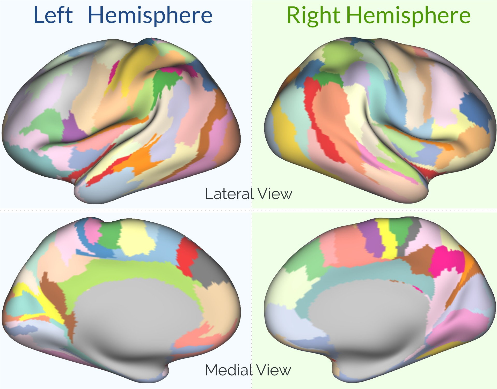

## Extrinsic Connectivity Based Atlas

Guillermo Gallardo, Athena Team, INRIA
*guillermo dot gallardo-diez at inria dot fr *

On [Gallardo et al (2016)](https://hal.archives-ouvertes.fr/hal-01358436/file/Gallardo.pdf) we presented a technique to parcellate the human cortex based on its extrinsic connectivity. Here we present an atlas extracted using this technique.

### CIFTI VOLUME *LABEL* _FILE_ over Colin27 Template

> The Colin27 Template is a stereotaxic average of 27 T1-weighted MRI scans of the same individual. 

- [Colin27 Template T1 Image (nii file)](files/colin/T1/colin27.nii.gz)

Here you can download our parcellation projected over the cortical surface of the Colin27 template:

- [Left Hemisphere Parcellation (nii file)](files/colin/parcellation/EC_atlas.L.colin27.label.nii)
- [Right Hemisphere Parcellation (nii file)](files/colin/parcellation/EC_atlas.R.colin27.label.nii)
> The above image was created using [fslview](https://fsl.fmrib.ox.ac.uk/fsl/fslwiki/) .

**These files can be opened using any software compatible with the NIFTI format**

### CIFTI VOLUME *LABEL* _FILE_ over HCP's Subject 100307 (MNI Space)

> HCP datasets are freely available to the scientific community. Here you can download our parcellation projected over the cortex of the subject 100307.

- [Left Hemisphere (nii file)](files/EC_atlas.L.100307.label.nii)
- [Right Hemisphere (nii file)](files/EC_atlas.R.100307.label.nii)

**These files can be opened using any software compatible with the NIFTI format**

### CIFTI SURFACES (32k) and CIFTI *LABEL* _FILE_

> CIFTI (Connectivity Informatics Technology Initiative) standardizes file formats for the storage of connectivity data. These formats are developed by the Human Connectome Project and other interested parties.

- Colin27 [surfaces](files/colin/surfaces/all_surfaces.zip) (created using [freesurfer](https://surfer.nmr.mgh.harvard.edu/) and the [HCP pipeline](http://www.humanconnectome.org/documentation/HCP-pipelines/))
- [Left Hemisphere Parcellation (gii file)](files/EC_atlas.L.32k.label.gii)
- [Right Hemisphere Parcellation (gii file)](files/EC_atlas.L.32k.label.gii)

**These files can be opened using Human Connectome's [workbench](https://www.humanconnectome.org/software/connectome-workbench.html)**

